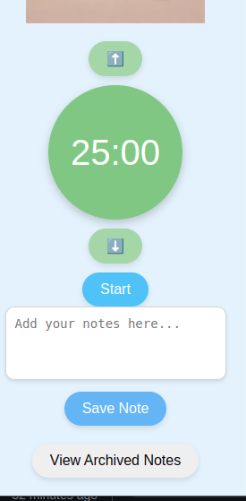

# Fokus Plugin

The Fokus Plugin is a simple, calming Pomodoro Timer Chrome Extension that helps you stay productive and take meaningful breaks. It includes real-time time adjustment, note-taking with an archive feature, fitness/yoga suggestions during breaks, and a tranquil zen image for focus.


### Features
- **Pomodoro Timer**: Switches between a 25-minute focus period and a 5-minute break, with adjustable times even during an active session.
- **Dynamic Timer Adjustment**: Modify the focus/break time in real-time using the ⬆️ and ⬇️ buttons.
- **Zen Image**: A peaceful image displayed for calm focus.
- **Notes Archive**: Take notes during your session and archive them for future review.
- **Fitness/Yoga Suggestions**: Provides a simple fitness or yoga suggestion during your break to keep you refreshed.
- **Background Timer**: The timer runs in the background even if the extension is closed, ensuring uninterrupted Pomodoro sessions.

### Installation
1. Clone this repository or download it as a ZIP file:
   ```bash
   git clone https://github.com/your-username/fokus-plugin.git
   cd fokus-plugin
2. Open Chrome and go to chrome://extensions/.
3. Enable "Developer Mode" in the top right corner.
4. Click on "Load unpacked" and select the fokus-plugin directory.
5. the Fokus Plugin icon will now appear in your Chrome extensions bar.

## Usage
Start/Stop: Click the "Start" button to begin a Pomodoro session. The timer will count down, switching colors to indicate focus (green) or break (red).
Adjust Timer: Use the ⬆️ and ⬇️ buttons above and below the timer to increase or decrease the focus/break time by 1 minute.
Notes and Archive: Take notes during focus sessions. Notes can be archived and reviewed by clicking "View Archived Notes."
Fitness/Yoga: During breaks, the plugin offers simple fitness or yoga suggestions.
Background Mode: The timer runs in the background, so it continues even if the plugin popup is closed.
Icons and Image
The zen image is located at icons/zen.png, and it is displayed small and centered in the plugin.

## License
This project is licensed under the MIT License. For more information, please see the LICENSE file included in this repository.

### Demo Picture


